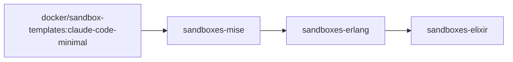

# sandboxes

Ready-to-use [Docker Sandboxes](https://docs.docker.com/ai/sandboxes/) (`sbx`) templates for Erlang and Elixir development with Claude Code.

Each image extends Docker's `claude-code-minimal` template (Ubuntu 26.04) with a toolchain managed by [mise](https://mise.jdx.dev), and keeps build output in a `.sbx/` directory so that a sandbox and your host can build the same checkout without clobbering each other.

## Images

| Image | Adds | Details |
|---|---|---|
| `ghcr.io/groguelon/sandboxes-mise` | mise, direnv | [images/mise](images/mise/README.md) |
| `ghcr.io/groguelon/sandboxes-erlang` | Erlang/OTP, rebar3, C toolchain | [images/erlang](images/erlang/README.md) |
| `ghcr.io/groguelon/sandboxes-elixir` | Elixir, Hex, inotify-tools | [images/elixir](images/elixir/README.md) |

Each image builds on the previous one:



All images are published for `linux/amd64` and `linux/arm64` under a single tag; `sbx` pulls the variant matching your machine.

## Quick start

```sh
cd my-elixir-project
sbx run claude --template ghcr.io/groguelon/sandboxes-elixir:claude-code-minimal
```

Template references must include the registry domain (`ghcr.io/...`).

Add the build directory to your project's `.gitignore`:

```gitignore
.sbx/
```

## Tags

Every image has a floating tag and version-pinned tags. The floating `claude-code-minimal` tag always points to the latest build.

| Image | Tags |
|---|---|
| mise | `claude-code-minimal`<br>`<mise>-claude-code-minimal` |
| erlang | `claude-code-minimal`<br>`<otp>-claude-code-minimal`<br>`<otp>-mise-<mise>-claude-code-minimal` |
| elixir | `claude-code-minimal`<br>`<elixir>-claude-code-minimal`<br>`<elixir>-erlang-<otp>-claude-code-minimal`<br>`<elixir>-erlang-<otp>-mise-<mise>-claude-code-minimal` |

For example: `ghcr.io/groguelon/sandboxes-elixir:1.20.4-erlang-29.1.1-claude-code-minimal`.

Version tags describe the toolchain inside the image, not a frozen image: they are rebuilt, and move, whenever the upstream `claude-code-minimal` template is updated.

## Working in the sandbox

**Build output lives in `.sbx/`.** The sandbox works on your real checkout, so compiled artifacts (including native NIFs) would collide with the ones your host builds. Mix and rebar3 are configured to write to `.sbx/` instead of `_build/` and `deps/`; see each image's README for the exact variables.

**Git worktrees.** Every tool writes inside the project directory, so each worktree gets its own dependencies and build output with no extra configuration. Downloaded package caches (Hex, rebar3) live in the sandbox's home directory and are shared.

**Project-specific versions.** The images ship one global version of each tool. If your project pins others in `.tool-versions` or `mise.toml`, mise installs them on first use (`mise install`). A `mise.toml` must be trusted first with `mise trust`.

**Network access.** Sandboxes use a default-deny network policy with an allowlist for common package managers and code hosts. If a download is blocked, allow the host:

```sh
sbx policy allow network hex.pm
```

## Extending with Kits v2

[Kits](https://docs.docker.com/ai/sandboxes/customize/kits-v2/) layer network rules, setup commands, files, ports and agent instructions on top of a sandbox. A mixin combines directly with these templates and the built-in `claude` agent.

A kit is a directory with a `spec.yaml`, plus optional files copied into the sandbox:

```text
my-kit/
├── spec.yaml
└── files/
    ├── home/        # copied to /home/agent/
    └── workspace/   # copied to the project directory
```

For example, a mixin granting the hosts an Elixir project needs, and telling the agent where build output goes:

```yaml
# hex/spec.yaml
schemaVersion: "2"
kind: mixin
name: hex
displayName: Hex
description: Network access for Hex packages and git dependencies
requires:
  agent: claude

permissions:
  network:
    allow:
      - hex.pm                # Hex API
      - repo.hex.pm           # Hex packages
      - builds.hex.pm         # Erlang and Elixir builds used by mise
      - mise-versions.jdx.dev # mise version lists
      - github.com            # git dependencies

agentInstructions:
  content: |
    Mix writes build output to .sbx/_build and dependencies to .sbx/deps,
    not _build/ and deps/.
```

Check it, then run it with a template:

```sh
sbx kit validate ./hex
sbx run claude --template ghcr.io/groguelon/sandboxes-elixir:claude-code-minimal --kit ./hex
```

Stack more mixins with extra `--kit` flags; they apply in order. Kits can also come from git (`"git+https://github.com/<org>/<repo>.git#ref=main&dir=kits/hex"`) or a registry (`sbx kit push ./hex ghcr.io/<org>/hex:1.0`). Each image's README has more examples:

- [mise](images/mise/README.md#kit-example-nodejs): install Node.js with mise, with a version argument.
- [elixir](images/elixir/README.md#kit-examples): publish the Phoenix port, ship an `.iex.exs`.

## How the images are built

GitHub Actions rebuild the images on a schedule and only push when something changed: a new tool release, or a new digest of the parent image (which is how Claude Code updates in the upstream template reach every image).

| Workflow | Schedule (America/New_York) | Also runs after |
|---|---|---|
| [`mise`](.github/workflows/mise.yml) | 09:00, 21:00 | — |
| [`erlang`](.github/workflows/erlang.yml) | 00:00, 06:00, 12:00, 18:00 | `mise` |
| [`elixir`](.github/workflows/elixir.yml) | 00:30, 06:30, 12:30, 18:30 | `erlang` |

Each workflow's `check` job compares the latest versions with the ones recorded in the published image's annotations (`io.github.groguelon.sandboxes.*`) and writes a comparison table to the run summary. Builds go through [`build-image`](.github/workflows/build-image.yml), which builds each architecture on a native runner (`ubuntu-26.04`, `ubuntu-26.04-arm`) and merges them into one multi-platform image. Every workflow can be run by hand from the Actions tab, with a `force` option to rebuild regardless.

## Building locally

Each Dockerfile has defaults for every build argument, so a plain build works:

```sh
docker buildx build images/elixir -t ghcr.io/<you>/sandboxes-elixir:claude-code-minimal --push
```

`sbx` pulls templates from a registry, so push the image before using it.

## Repository layout

```text
.github/
├── scripts/lib.sh       # version lookups and registry helpers for the workflows
└── workflows/           # mise, erlang, elixir and the shared build-image
images/
├── mise/
├── erlang/
└── elixir/
```
